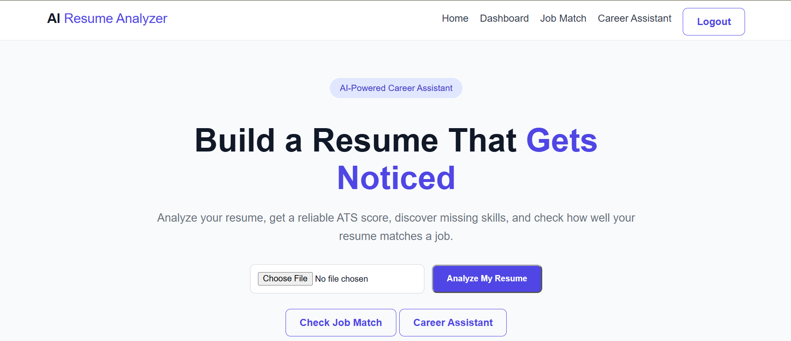
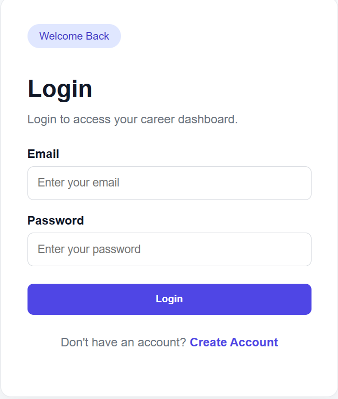
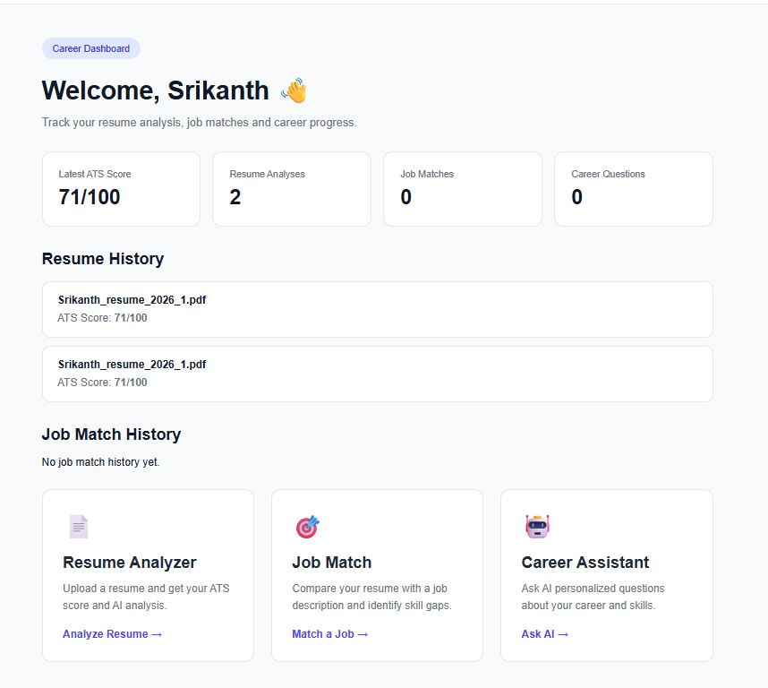
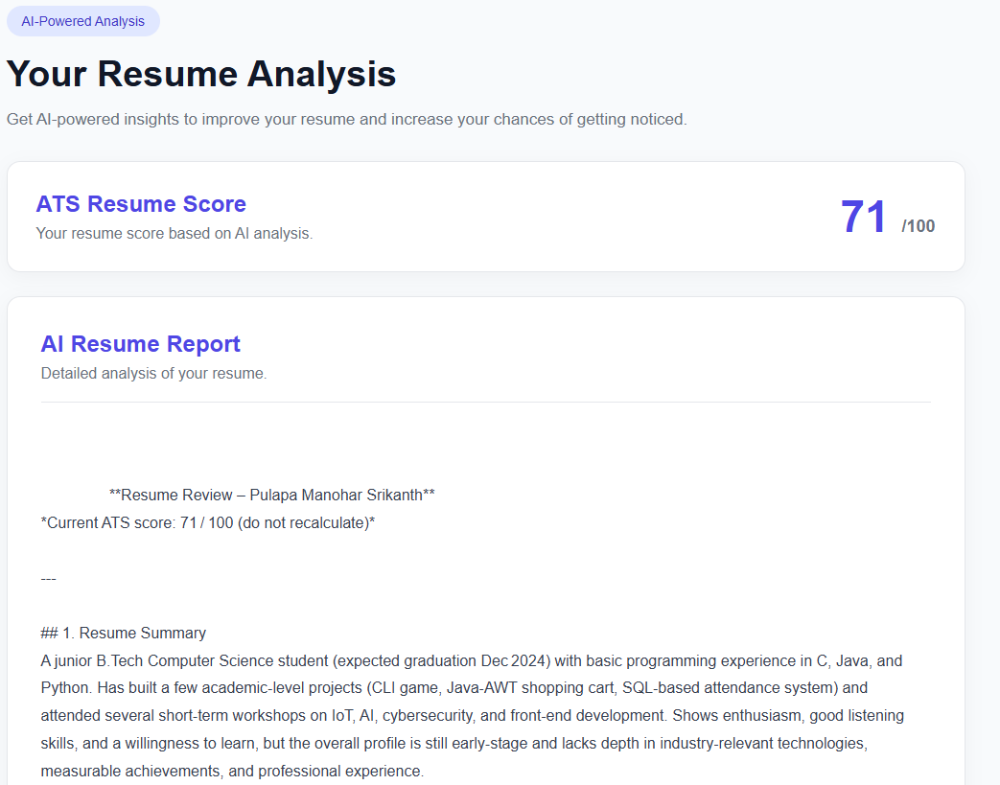

# AI Resume Analyzer & Career Assistant

An AI-powered web application that analyzes resumes, calculates ATS scores, matches resumes with job descriptions, and provides personalized career guidance.

## 🚀 Features

- 📄 PDF Resume Upload
- 📊 ATS Resume Scoring
- 🤖 AI-Powered Resume Analysis
- 🎯 Job Description Matching
- 🔍 Matched & Missing Skills Detection
- 💬 AI Career Assistant
- 👤 User Signup & Login
- 🔐 Secure Password Hashing
- 📚 Resume & Job Match History
- 📈 Personalized Dashboard
- 🗄️ MongoDB Data Storage
- 📱 Responsive Web Interface

## 🛠️ Technologies Used

### Backend
- Python
- Flask

### AI
- Groq API
- Large Language Model

### Database
- MongoDB Atlas

### Frontend
- HTML
- CSS
- Jinja2

### Other Technologies
- PyMuPDF
- Git
- GitHub
- Python-dotenv

## 🏗️ Project Architecture

```text
User
 │
 ▼
Flask Web Application
 │
 ├── Resume Analyzer
 │      ├── PDF Extraction
 │      ├── ATS Scoring
 │      └── AI Analysis
 │
 ├── Job Match
 │      ├── Skill Matching
 │      ├── Missing Skills
 │      └── AI Analysis
 │
 ├── Career Assistant
 │      └── Resume-based AI Advice
 │
 └── User Dashboard
        ├── Resume History
        ├── Job Match History
        └── Career History
 │
 ▼
MongoDB Atlas
```
## 📁 Project Structure

```text
AI-Resume-Analyzer/
│
├── app.py
├── requirements.txt
├── README.md
├── .gitignore
│
├── static/
│   └── css/
│       └── style.css
│
├── templates/
│   ├── index.html
│   ├── login.html
│   ├── signup.html
│   ├── dashboard.html
│   ├── analysis.html
│   ├── job_match.html
│   ├── job_result.html
│   └── career_assistant.html
│
└── uploads/
```


## 📸 Screenshots

### 🏠 Home Page



### 🔐 Login Page



### 📊 Dashboard



### 📄 Resume Analysis




## ⚙️ Installation

### 1. Clone the repository

```bash
git clone https://github.com/SRIKANTHPULAPA/AI-Resume-Analyzer.git
```

### 2. Open the project

```bash
cd AI-Resume-Analyzer
```

### 3. Create a virtual environment

```bash
python -m venv venv
```

### 4. Activate the virtual environment

Windows PowerShell:

```powershell
.\venv\Scripts\Activate.ps1
```

### 5. Install dependencies

```bash
pip install -r requirements.txt
```

## 🔐 Environment Variables

Create a `.env` file in the project root:

```text
GROQ_API_KEY=your_groq_api_key
MONGO_URI=your_mongodb_connection_string
FLASK_SECRET_KEY=your_secret_key
```

Never upload the `.env` file to GitHub.

## ▶️ Run the Application

```bash
python app.py
```

Open the application:

```text
http://127.0.0.1:5000
```

For devices connected to the same local network:

```text
http://YOUR_LOCAL_IP:5000
```

## 🔄 Application Workflow

```text
Signup / Login
      ↓
Dashboard
      ↓
Upload Resume
      ↓
PDF Text Extraction
      ↓
ATS Score
      ↓
AI Resume Analysis
      ↓
Save Results to MongoDB
      ↓
Job Matching
      ↓
Career Assistant
```

## 🎯 ATS Analysis

The application evaluates important resume sections such as:

- Contact Information
- Education
- Technical Skills
- Projects
- Experience
- Certifications
- Achievements
- Resume Structure
- Content Quality

The result is presented as an ATS score out of 100.

## 🎯 Job Matching

Users can enter a job description and compare it with their resume.

The system identifies:

- Job Match Score
- Matched Skills
- Missing Skills
- Skill Gaps
- Application Recommendations

## 🤖 Career Assistant

The AI Career Assistant uses the uploaded resume to provide personalized guidance related to:

- Career paths
- Technical skills
- Skill gaps
- Job preparation
- Resume improvement
- Learning recommendations

## 🗄️ Database

MongoDB Atlas is used to store:

- User accounts
- Resume analysis results
- Job matching results
- Career assistant conversations

Passwords are stored using secure password hashing.

## 🔒 Security

The project uses:

- Password hashing
- Session-based authentication
- Environment variables for API keys
- `.gitignore` protection for sensitive files
- User-specific database records

## 📱 Responsive Design

The application is designed to work across:

- Desktop
- Laptop
- Tablet
- Mobile devices

## 🚧 Future Improvements

Possible future enhancements include:

- Resume improvement generator
- Multiple resume versions
- Job recommendation system
- Skill learning roadmap
- Email notifications
- Advanced analytics
- Production deployment
- AI-powered resume rewriting

## 👨‍💻 Author

**Srikanth Pulapa**

Computer Science & Engineering

## 📌 Project Status

**Completed Core Features**

The application currently supports resume analysis, ATS scoring, job matching, AI career assistance, authentication, MongoDB storage, history tracking, and responsive web access.